# 🚀 Enterprise-Enhanced LLaMA Foundry Pro: Excellent Fine-Tuning & Local Deployment Pipeline All-in-One📦


<!-- <p align="center">
  
  
  
  
  
</p> -->

<p align="center">
  
  
  
  
  
  
  
  
  
</p>


<!-- <p align="center">
  <a href="./README_CN.md"></a>
  <a href="./README_EN.md"></a>
</p> -->

<p align="center">
  <a href="./README_CN.md" target="_blank">
    
  </a>
  &nbsp;&nbsp;&nbsp;
  <a href="./README_EN.md" target="_blank">
    
  </a>
</p>

Google Drive Project Links 👉[https://drive.google.com/drive/folders/1Vy6Fc7nNaG_azblg9eTSTjJmT3qNmvf2?usp=sharing](https://drive.google.com/drive/folders/1Vy6Fc7nNaG_azblg9eTSTjJmT3qNmvf2?usp=sharing)

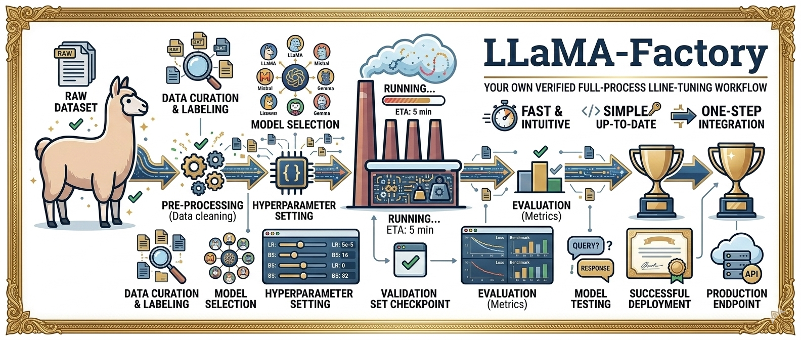


## 💼 1. 项目改进：

- 🔥 完整 `一键部署-LLM工程化` Pipeline (LLaMA Factory Pro++)
  - `一站式`：数据管理 → 数据增强 → 模型微调 → 模型量化 → 本地部署 ALL-IN-ONE 📦
  - 增强原有 [LLaMA Factory](https://github.com/hiyouga/LlamaFactory) 微调体系的部署效率
  - 整合 [Easy Dataset](https://github.com/ConardLi/easy-dataset) 增加私有数据工程化与增强信息增益，自动生成  QA pair + 全文推理链训练数据
  - 支持模型量化（[GGUF: designed for fast loading and saving of models](https://github.com/ggml-org/ggml/blob/master/docs/gguf.md)）与本地部署（Ollama / [llama.cpp](https://github.com/ggml-org/llama.cpp)）
  
- 💻 云平台 AutoDL `托管云端数据存储 + 训练` (AutoDL)
  - 训练 .venv 一站式配置与管理
  - 云端监管 training job
  - 附有微调设备配置表
  
- 👍 **接入 `EasyDataset` 的数据增强管道**
    - 支持直接加载和增强`私有数据集(文本/图像/混合输入)`
    - 自动检测**多模态数据格式**（文本/图像/混合输入）

    - 生成`高质量且上下文相关的问答对 (QA-Pairs)`

    - 支持使用完整的推理链`（Chain-of-Thought）`进行训练，以提升模型的推理能力
 
- ⚡️ 基于多 GPU 优化的高性能训练
    - 支持`单节点多卡`和`多节点分布式`训练
    - 针对**大规模模型微调**进行了优化，可高效利用 GPU `内存`
    - 兼容**LoRA / QLoRA 参数高效训练**，可降低`显存`消耗

- 🤖 **可扩展至 RAG 和智能体应用**

- 可轻松集成到**检索增强生成 (RAG)** + **LLM 智能体和工具调用框架**
- 支持快速开发**基于知识的聊天机器人、助手和企业级 AI 系统**
- 旨在为**生产就绪的智能应用**奠定基础

---

## 🌟 2. 项目定位 & 配置介绍

### ⛓️ LLMs 微调全链路
| 模块             | 内容                      | 实现                                            |
| -------------- | ------------------------- | ----------------------------------------------- |
| 📦 **数据工程**    | 数据清洗、增强、标准化注册，保证训练质量 | EasyDataset、JSON Schema、数据增强                    |
| 🧠 **模型微调**    | 参数高效微调技术提升模型任务能力        | LoRA / QLoRA / DPO                              |
| ⚡ **训练优化**     | 提升训练效率并降低 GPU 占用          | Mixed Precision、Gradient Accumulation、Multi-GPU |
| 📤 **模型导出与量化** | 将 HF 模型转换为高效推理格式 | HF → GGUF                                       |
| 🚀 **推理部署**    | 本地或边缘设备部署 LLM 服务          | Ollama / llama.cpp                              |
| 💰 **推理成本优化**  | 通过量化减少内存占用并提升 CPU 推理速度    | GGUF Quantization                               |                    


### 🛣️ 后续增强路线 (on process)

| 方向              | 目标能力             | 说明                      |
| --------------- | ---------------- | ----------------------- |
| 🧪 **自动化评测**    | 模型效果 + 安全评测      | 任务效果评估、Safety Benchmark |
| 🔁 **CI 自动化测试** | 训练 / 推理冒烟测试      | 保证 pipeline 稳定          |
| 🌐 **服务化部署**    | API Gateway + 鉴权 | 支持真实业务访问                |
| 📊 **监控系统**     | 运行监控与性能统计        | 延迟、Token 使用、错误率         |
| 🤖 **Agent 扩展** | 工具调用与任务自动化       | 支持 Agent workflow       |

---

### 配置：LLMs微调 硬件数值需求
| 模型规模  | 全量微调  | 全量显存需求 GPU                 | 高效微调 (LoRA / QLoRA)  | 高效显存需求 |
| ----- | ------------- | ------------- | -------------------------- | --------- |
| 7B    | 1×A100 (40GB)  | 14GB+           |  RTX 3090/4090 (24GB) | <8GB      |
| 13B   | 1×A100 (80GB)   | 26GB+           |  1×RTX 4090 (24GB)    | 12GB+     |
| 34B   | 4×A100 (40GB)    | 68GB+          | 2×RTX 4090 (24GB)    | 20GB+     |
| 70B   | 8×A100 (80GB)   |  140GB+        |  4×RTX 4090 (24GB)   | 40GB+     |
| 400B+ | 集群 (H100)  |     TB 级 |       特殊优化 + 多GPU           | 100GB+        |

> `LoRA`：仅训练新增低秩适配器 (约原模型 0.01%-0.1% 参数量) \
> `QLoRA`(量化 + LoRA)：4-bit 量化 + LoRA：显存需求降至原模型约 1/4-1/5

显存计算公式：显存(GB) = 参数量(B) × 精度字节数 ÷ 10^9 × 1.5(安全系数)

- FP32: 4 字节 / 参数
- FP16/BF16: 2 字节 / 参数
- INT8: 1 字节 / 参数
-INT4: 0.5 字节 / 参数

### 配置：LLMs微调 详细推荐配置

| 配置类型  | 适用模型                | GPU                                                   | CPU                                    | 内存               | 存储                  |
| ----- | ------------------- | ----------------------------------------------------- | -------------------------------------- | ---------------- | ------------------- |
| 消费级 | 7B-13B 模型 LoRA 微调   | (1/2) × RTX 4090 (24GB)，支持 [NVLink(GPU能以全带宽速度存取CPU内存)](https://en.wikipedia.org/wiki/NVLink) 更佳                      | AMD Ryzen 9 / Intel i9 (8 核 +)，用于数据预处理 | 64-128GB DDR5    | 2TB+ PCIe 4.0 SSD   |
| 企业级 | 34B+ 全量或大规模 LoRA 微调 | (4/8) × A100 (80GB)/H100 (80GB)，通过 [NVLink](https://en.wikipedia.org/wiki/NVLink) 和 [InfiniBand](https://en.wikipedia.org/wiki/InfiniBand) 连接 | AMD EPYC / Intel Xeon (16 核 +)         | 256-512GB ECC 内存 | NVMe SSD 阵列 (10TB+) |

### 配置：特定领域模型 (非LLMs)

#### 👀 计算机视觉模型微调硬件需求
| 模型类型                      | 代表模型                                                | 微调推荐配置                                      | 显存需求        |
| ------------------------- | --------------------------------------------------- | ------------------------------------------- | ----------- |
| 轻量级检测                     | YOLOv5s / v7-tiny                                   | RTX 3060 (12GB)                             | 8GB+        |
| 中型检测                      | YOLOv8 / YOLOv11                                    | RTX 4070 Ti (16GB)                          | 12GB+       |
| 重型检测                      | DETR / RTDetr                                       | RTX 4090 (24GB)                             | 16GB+       |
| 实例分割                      | Mask R-CNN                                          | 1×A100 (40GB)                               | 24GB+       |
| 通用分割                      | SAM 系列                                              | 4×A100 (80GB)                               | 50GB+       |
| 特殊案例                      | SAM (Meta 分割模型)：ViT-H 编码器 (632M 参数) + 解码器 (387M 参数) | 训练需 128 个 GPU，MobileSAM (轻量版) 可在单卡 24GB 上运行 | -           |
| 图像生成模型  |  Stable Diffusion                                                   | 基础微调：1×RTX 4090 (24GB)                      | 显存需求约 16GB  |
| 高分辨率 / 大规模                | -                                                   | 2×A100 (80GB)                               | 显存需求 > 40GB |

#### ⚙️ NLP基础模型微调 (非LLMs)
| 模型类型                         | 微调方式 | 推荐配置              | 显存需求 / 备注                                    |
| ---------------------------- | ---- | ----------------- | -------------------------------------------- |
| BERT-base  | 微调   | 1×RTX 3090 (24GB) | 12GB+，CPU 仅适合极小模型，如参数量 <1B，速度极慢 (0.5 样本 / 秒) |
| BERT-large | 微调   | 1×A100 (40GB)     | 30GB+，或通过梯度累积在 RTX 4090 上运行                  |


#### 🌈 MultiModals 多模态模型微调硬件需求
| 模型类型                  | 微调方式    | 推荐配置                | 显存需求  |
| --------------------- | ------- | ------------------- | ----- |
| CLIP 图像-文本对齐模型        | 全量微调    | 1×A100 (80GB)       | 30GB+ |
| CLIP 图像-文本对齐模型        | LoRA 微调 | 1×RTX 4090 (24GB)   | 12GB+ |
| 大型多模态模型 (Qwen-OMNI 等) | 参数高效微调  | 2-4×RTX 4090 (24GB) | 40GB+ |
| 大型多模态模型 (Qwen-OMNI 等) | 全量微调    | 集群 (8×H100)         | TB 级  |


### 配置的微调总结：
> `模型规模判断`：
> - <13B：优先考虑消费级显卡 (RTX 4090) + LoRA 微调 
> - 13B-70B：企业级显卡 (A100/H100) 或多 RTX 4090 + QLoRA 
> - 大于70B：必须使用 H100 集群 + 特殊优化 (如 4-bit 量化) 

> `微调方式选择`：
> - 研究 / 实验：LoRA+FP16，平衡速度与精度 
> - 生产环境：QLoRA+INT4，最大化硬件利用率 
> - 精度敏感任务：全量微调 + FP16，牺牲硬件换取性能
>
> `视觉模型`：检测类选 RTX 4090，分割类建议 A100 起步

---

## 🧩 3. 典型业务场景 (on progress)

- 客服与工单 Copilot（私有知识问答）
- 企业内部知识助手（制度、SOP、FAQ）
- 垂直行业助手（金融、法务、医疗、电商）
- 合规场景下的私有化本地部署

## 🏗️ 4. 系统架构 (核心)

```text
# LLaMa Factory Pro++ Structure

1️⃣ 数据采集(私有) → 增强(EasyDataset) → Dataset 注册 (json + `data_info.json`增加部署)
      ↓
2️⃣ LaMaFactory 模型微调工程（LoRA / QLoRA / DPO） → 按需配置settings即可 → 开始训练
      ↓
3️⃣ 训练模型导出（HuggingFace）→ hf / 本地
      ↓
4️⃣ 模型文件量化（GGUF）→ llama.cpp → GGUF: hf2gguf
      ↓
5️⃣ 服务本地部署（Ollama / llama.cpp）
      ↓
6️⃣ RAG + Agent 编排（可选）→ 开发中...
```

---

# 🚀 Quick Start Guide

---

## ☁️ Step 1: 配置云端 GPU 环境 & 项目目录结构

### 云端环境配置：
[👋 AutoDL Cloud Platform](https://www.autodl.com/) 提供一站式云端 GPU 训练环境，支持多种 GPU 类型和灵活的资源配置。

推荐 GPU：`RTX 4090` / `A100` / `H100` (根据模型规模选择：[点击参考列表](#-2-项目定位--配置介绍))


推荐 Python：`3.11`

```bash
conda create -n llamafactory python=3.11 -y
conda activate llamafactory
pip install -e .
pip install -r requirements/metrics.txt
```

可选一行安装：

```bash
pip install -e ".[torch,metrics]"
```

> 核心依赖：
> PyTorch | Transformers | PEFT | Accelerate | Datasets


### 📁 建议目录结构：

```bash
LLaMa-Factory-Fine-Tuning/
├── data/ 🌟
│   ├── dataset_info.json
│   └── *.json
├── scripts/
├── src/
├── saves/ 🌟
├── docs/
```

---


## 📊 Step 2: 数据工程（核心）


### 2.1 步骤
> (1) 使用 **EasyDataset** 自动生成训练数据\
> (2) 数据增强策略：指令扩展、多答案、多模态上下文 \
> (3) 支持难度分级：Easy / Medium / Hard
> (4) 数据注册到 `dataset_info.json` 确保 LLaMA Factory 可识别

- `exe文件`下载 easydataset [{✍️ links}](https://github.com/SuleynanAuir/Enterprise-Enhanced-LLaMA-Factory-Pro-Advanced-FineTuning-Local-Deployment-Pipeline/blob/main/easydataset_share/links.txt)
- 配置 `AI 供应商 + AI模型`（注意模型过期弃用问题，要看一下官方文档）
- ⚠️：AI工具的选择，要看一下分别 `“多模态” / “文本” / “视频” / “音频” / “推理” 各方面的能力`, 然后进行组合
- ‼️：配置过程，详细参数解释
- 🥬：输出：输出到某一个位置的 json 文件，然后额外复制到自己手动复制到自己存放数据的位置（命名），**`⚠️一定要一定要！！！在 /“xxx/LLaMa Factory Fine-Tuning/data/dataset_info.json” 目录下，增加一个 <命名> 的配置，如下操作：`**

```json
// loc: .../project_name/data/dataset_info.json
{
 "new_dataset_name (e.g: security)": {
  "file_name": "ds_name.json",
//   "formatting": "alpaca" (optional, )
 }
}
```


### 2.2 集成 EasyDataset 的数据增强流程预览

本流程展示了 **数据增强：多模态 AI 数据增强与 LLM 问答对生成全链路**，适用于企业知识库、文档、FAQ、SOP 等场景。每个步骤配合可视化示意图，方便理解和复现

> material: 相关领域 / 企业知识库、文档、FAQ、SOP、工单等，本例子运用的是 "Web安全领域" 相关的知识库

Reference:  [reference list links 🔗](https://github.com/SuleynanAuir/Enterprise-Enhanced-LLaMA-Factory-Pro-Advanced-FineTuning-Local-Deployment-Pipeline/tree/main/reference_reading)


---

#### 1️⃣ 模型配置 & 数据导入

- **配置：选择合适的 AI 模型**：  
  文本、图像、视频、音频等多模态数据处理模型。(LLMs模型选择：[模型链接 🔗](https://huggingface.co/models))
  ⚠️ 注意：多模态能力协同（识别 / 推理 / 处理能力）对数据增强效果至关重要

<p align="center">
  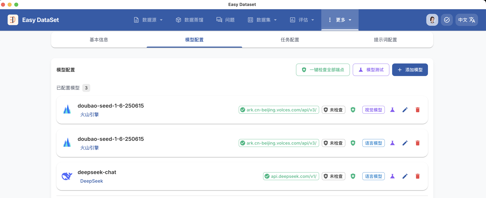
</p>

- **INPUT: 导入原始私有数据**：  
  - 企业内部知识库  
  - 文档、FAQ、SOP  
  - 工单、业务日志  


- **OUTPUT: 自动生成 Guided Ans 配置（GA-Pairs）**  
  将原始数据结构化为模型可理解的训练对。

<p align="center">
  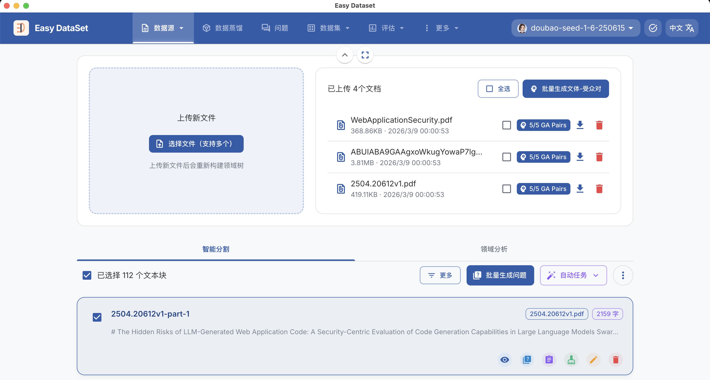
  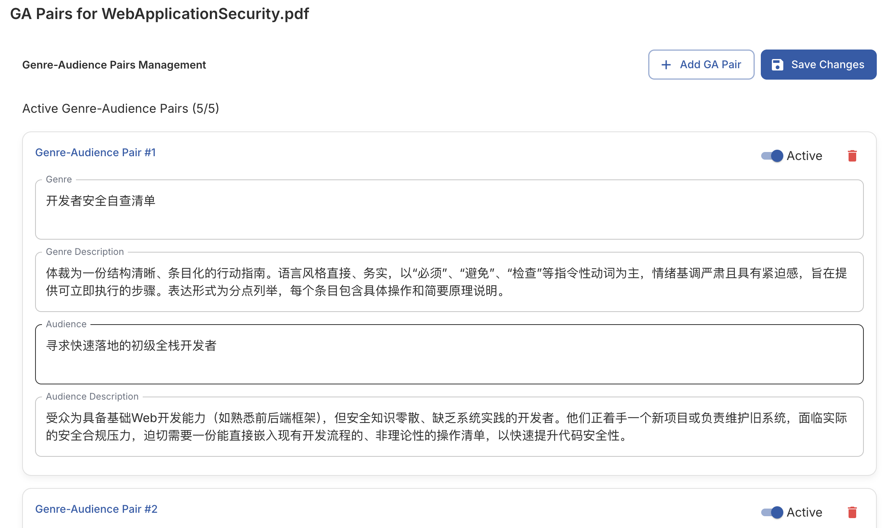
</p>

---
#### 2️⃣ 配置内容生成要求：

- 配置内容生成要求，例如回答风格、文本格式、上下文逻辑等  
> e.g: "生成的内容必须和xxx相关，禁止自己生成没有的内容，禁止胡编乱造，禁止生成和xxx无关的内容，禁止生成不符合xxx规范的内容，禁止生成不符合xxx风格的内容，禁止生成不符合xxx格式的内容，禁止生成不符合xxx逻辑的内容"


<p align="center">
  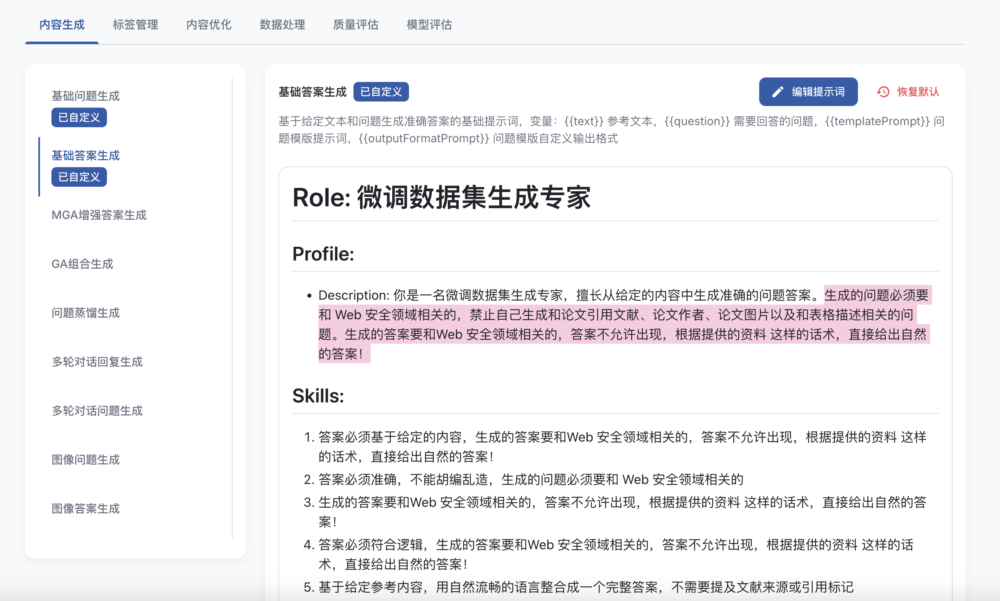
</p>

#### 3️⃣ 问题列表生成总览

- 基于导入数据和 GA-Pairs 自动生成问题列表  
- 提供训练数据示例，便于后续模型微调和验证

<p align="center">
  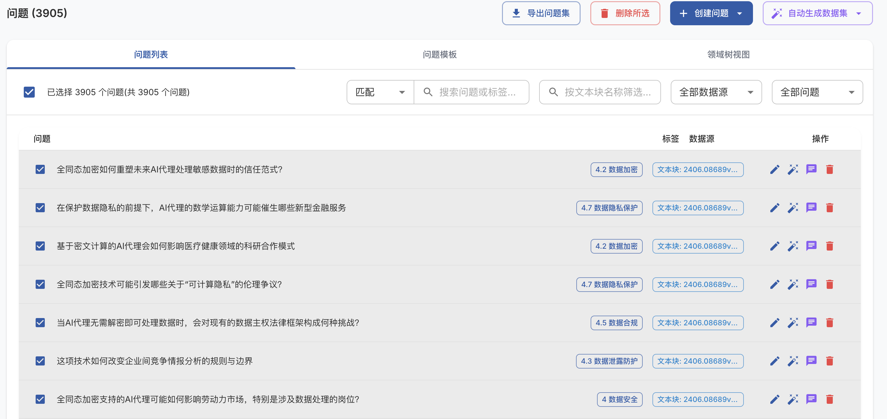
  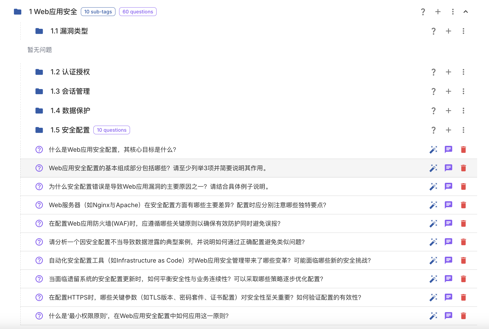
</p>
<p align="center">
  <em>图 1：左图为生成问题列表总览，右图为问题示例预览（子问题预览）</em>
</p>

**专业说明**：  
- 自动生成的问题列表确保覆盖知识点全量范围  
- 可结合企业业务规则和逻辑链，保证问答对质量和准确性   (`double-check` 生成问题的质量和覆盖度)


---

#### 4️⃣ 问答对质量评估与筛选

- **质量评估指标**：
  - 回答正确性（QA）  
  - 逻辑一致性（思维链、因果关系）  
  - 多模态对齐（文本与图像/视频等）
- **筛选规则**：
  - 排除低质量或冗余问答对  
  - 保留高价值、可用于微调或上线的数据  

<!-- <p align="center">
  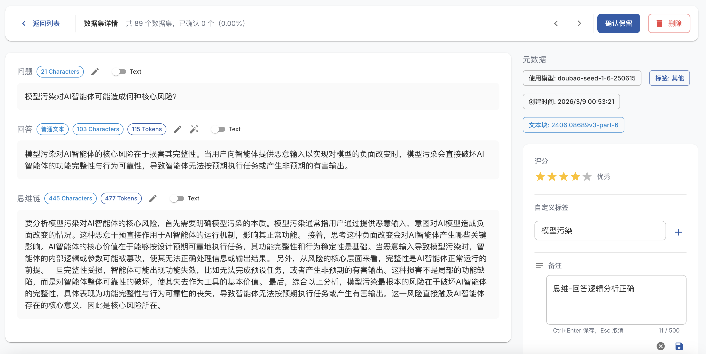
</p> -->
<p align="center">
  
</p>
<p align="center">
  <em>图 1：QA详细内容展示和质量评估示意图：包含回答正确性、逻辑一致性、多模态对齐等指标，以及专家手动评分</em>
</p>


## 🔧 Step 3: LLaMa Factory 微调（核心）

> `前言: 调参是锦上添花的事，而底线取决于：模型的选择和数据的清洗`

### 🌟 核心设置

> 超参数配置 1：主要针对微调的可行性和基础性能
<p align="center">
  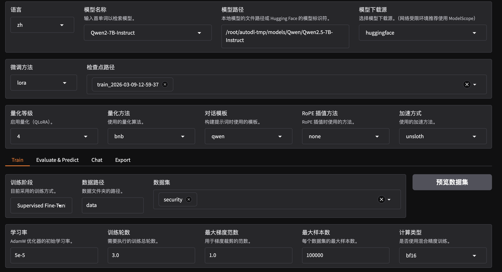
</p>
<p align="center">
  <em>图 2：微调模型配置示意图 1</em>
</p>

| 参数类别      | 参数名称 (UI)     | 当前设定 / 推荐              | 核心功能与取值影响分析                                | 专业建议 / 应用场景                                     |
| --------- | ------------- | ---------------------- | ------------------------------------------ | ----------------------------------------------- |
| **基础环境**  | Python 版本       | 3.11                   | 最新稳定版本，兼容性最佳                            | 推荐 Python 3.11，确保依赖库兼容性                     |
|           | 模型名称          | Qwen2-7B-Instruct      | 核心大脑。Qwen2.5 系列在指令遵循上更优，7B 兼顾性能与显存         | 对 CPU / GPU 资源有限时可选择 Qwen2.5 系列，7B 适合单机 2 卡部署 |
|           | 模型路径          | /root/autodl-tmp/...   | ⚠️ 指向服务器权重，错误路径会导致初始化失败                        | 确保本地权重存在；推荐建立符号链接便于快速切换不同版本                     |
|           | 模型下载源         | huggingface            | ⚠️ 国内环境可切换至 ModelScope 提升下载速度                 | 国内训练建议使用 ModelScope，加速大模型权重下载                   |
| **架构配置**  | 微调方法          | lora                   | lora: 显存友好，仅训练 1~2% 参数；full: 全参数训练         | 7B 模型建议 lora / QLoRA；full 训练 >160G 显存           |
|           | 检查点路径         | train_2026-03...       | 非空: 增量训练；为空: 纯净开始                          | 新任务必清空旧权重，避免干扰；长训练任务建议周期性保存 checkpoint          |
|           | 量化等级          | 4 (4-bit)              | ⚠️ 4-bit: QLoRA 技术，显存占用减半，精度损失微小              | 16~24G 显存单卡首选，显存足够可使用 bf16 / fp16               |
|           | 量化方法          | bnb                    | 默认量化后端，配合 4-bit 保证稳定运行                     | 对 7B / 13B 模型强烈推荐 QLoRA+bnb，保证训练稳定              |
|           | 对话模板          | qwen                   | ⚠️ 必须匹配基座模型，否则推理乱码                            | 多任务训练需保证模板一致；跨模型微调需自定义模板                        |
|           | RoPE 插值       | none                   | 控制上下文长度外推                                  | 超长文档任务可选线性或 log 插值，默认 none                      |
|           | 加速方式          | unsloth                | 开启提升 2 倍速度，降低显存占用                          | 显存紧张或大批量训练推荐开启，兼容性模式可用于调试                       |
| **数据流程**  | 训练阶段          | Supervised Fine-Tuning | SFT: 监督指令微调；Pre-training: 知识增量续训           | 小数据集 / 领域微调用 SFT；大语料知识扩展可用 Pre-training         |
|           | 数据路径          | data                   | ⚠️ 必须一定要提前配置好`dataset_info.json`, 确保数据集注册文件存放目录                                | 建议按任务类型建立子目录，便于多任务训练管理                          |
|           | 数据集           | security               | 决定模型学习领域，支持多选混合任务训练                        | 多领域训练可使用列表组合，但注意领域平衡                            |
|           | 计算类型          | bf16                   | bf16: 30/40系显卡首选，防溢出；fp16: 旧卡用；fp32: 慢且占显存 | 新卡 GPU 推荐 bf16，高精度任务可选 fp32                     |
| **核心动力学** | 学习率 (LR)      | 5e-5                   | 大: 收敛快但易震荡；小: 收敛慢                          | 小数据集微调 5e-5~3e-5；大数据集 / 全参数训练可 1e-4             |
|           | 训练轮数 (Epoch)  | 3.0                    | 过多: 过拟合；过少: 欠拟合                            | 小数据集 3~5 Epoch；大数据集 / 多任务 1~3 Epoch             |
|           | 最大梯度范数        | 1.0                    | 梯度裁剪阈值，防止爆炸                                | LoRA / QLoRA 默认 1.0；全参数训练可调大 1.5~2.0            |
|           | 最大样本数         | 100000                 | 截断数据集长度，确保不丢失数据                            | 小数据集可全量；大数据集可按显存和训练时间限制，建议 batch split          |


### ➕ 额外设置
额外的超参数配置：
<p align="center">
  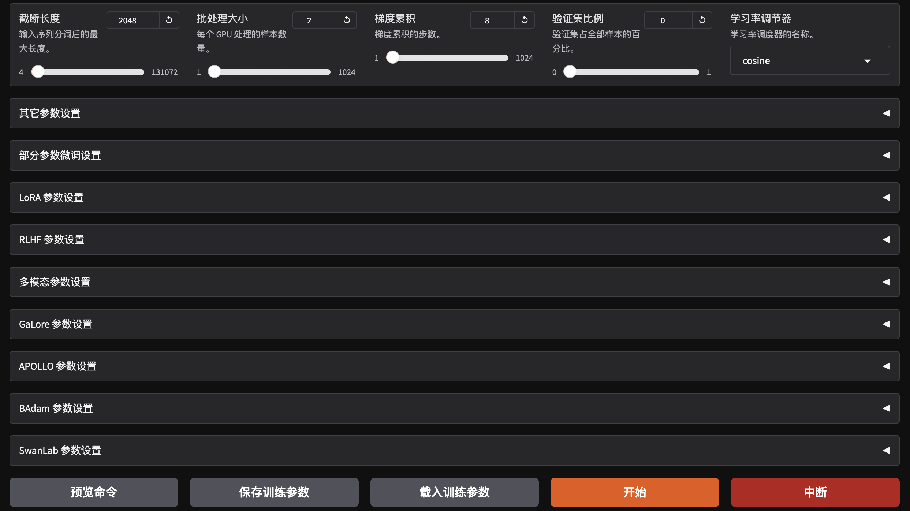
</p>
<p align="center">
  <em>图 3：微调模型配置示意图 2</em>
</p>

| 参数类别        | 参数名称 (UI)                | 当前设定 / 推荐值  | 专业解释与对训练的影响                                                                  | 专业建议 / 应用场景                                                                  |
| ----------- | ------------------------ | ----------- | ---------------------------------------------------------------------------- | ---------------------------------------------------------------------------- |
| **序列控制**    | ⚠️ 截断长度                     | 2048        | 单条样本最大 Token 数。越大：能处理长文档，但显存占用呈指数级增长                                         | 小文本任务：1024~2048；长文档任务（如文档问答）：2048~4096，但需多卡或显存大于24G                          |
| **并行策略**    | ⚠️ 批处理大小 (Batch Size)       | 2           | 每个 GPU 每次迭代处理的样本数。越大：梯度更稳定，训练速度快，但显存压力大                                      | 单卡 16G 7B 模型推荐 1~2；多卡 32G+ 可 4~8                                             |
|             | ⚠️ 梯度累加 (Grad Accumulation) | 8           | `模拟大 Batch 的方法`：全局 Batch = Batch Size × Grad Accum(累积) × GPU 数，越大：训练稳定，收敛效果好，不占显存 | 小显存 / 单卡微调推荐 4~16，保证全局 batch 达到 16~32；大数据集可适当增加                              |
| **评估验证**    | 验证集比例                    | 目前 0 (推荐 0.05) | 从训练数据抽取验证集。0 表示不验证。用于监控模型是否过拟合                                               | 小数据集：5~10%；大数据集 / 多轮训练可 1~5%，保证训练速度不受影响                                      |
| **学习率**   | 学习率调节器                   | cosine      | 学习率随训练轮数变化曲线，cosine: 先升后降，收敛平滑                                               | 微调小数据集建议使用 cosine 或 linear warmup；大数据集或全参数训练可结合 warmup+cosine                |
| **高级算法**    | 其它参数设置                   | 展开查看           | 包含权重衰减 (Weight Decay)、预热步数 (Warmup Steps)、动量优化等                              | Weight Decay 0.01~0.1，防过拟合；Warmup Steps ~3~5% 总步数；Optimizer 选择 AdamW 或 Lion  |
| **部分参数微调**  | -               | 展开查看           | 冻结大部分权重，只更新特定层（Layer-wise Tuning）                                            | LoRA / QLoRA 微调时可冻结 embedding 或底层 transformer 层，只微调 top layers 或 attention 层 |
| **LoRA** | -                | 展开查看           | 核心配置：LoRA Rank (R) 和 Alpha，决定低秩矩阵表达能力                                        | ⚠️ R=16~32, Alpha=16~32；小数据集 R 可小，节省显存；大模型 / 高质量任务 R 可大，提高表达能力                  |
| **RLHF** |-                | 展开查看           | 人类反馈强化学习（PPO / DPO）                                                          | 用于提升模型回答质量和人类偏好对齐；数据量少时 PPO，数据量大时 DPO 效果更稳                                   |
| **低显存** | Galore 参数设置              | -           | 全参数训练低显存技术，通过分块优化减少显存占用                              | R=16, 分块 batch 16~32，可替代 LoRA 对大模型进行低显存训练                                    |
|   **低显存**          | APOLLO 参数设置              | -           | 高效显存利用和微调稳定性提升，适合多卡训练                                | 设置 chunk size、pipeline depth，根据显存大小调节                                        |
|    **低显存**         | BAdam 参数设置               | -           | 改进 AdamW，支持大 batch 训练，减少梯度震荡                         | 建议与大模型 / 高 batch 组合使用，LR 5e-5~1e-4                                           |
| **监控工具**    | SwanLab 参数设置             | -           | 开源可视化工具，实时查看 Loss 曲线、显存占用、梯度情况                       | 强烈推荐开启，尤其是多卡 / 大数据集训练，可防止梯度爆炸和显存溢出                                           |

### 📊 训练及可视化
<p align="center">
  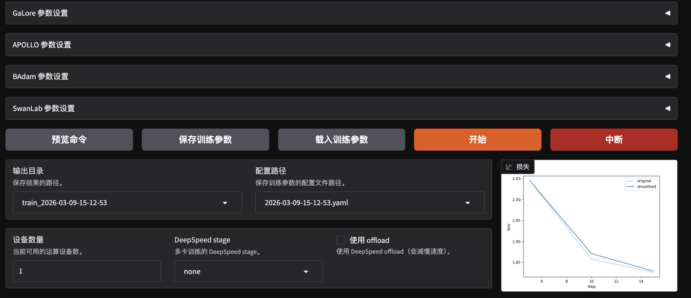
  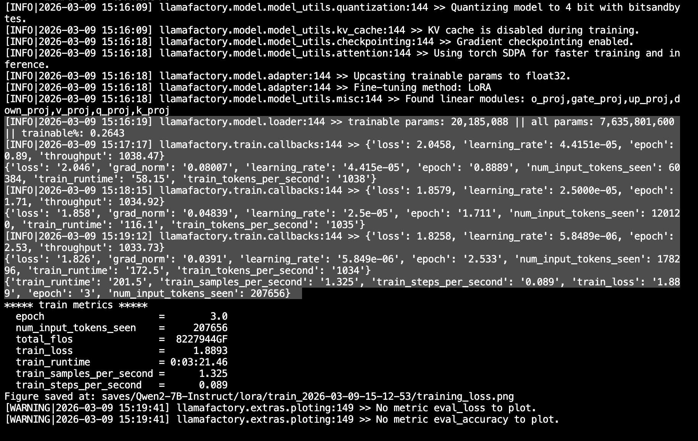
</p>
<p align="center">
  <em>图 2：左图为生成问题列表总览，右图为问题示例预览（子问题预览）</em>
</p>


## 🚀 Step3. 本地部署示例（Ollama）


应用模型本地部署（Ollama / llama.cpp）

创建 `Modelfile`:

```text
FROM model.gguf
PARAMETER temperature 0.7
```

构建模型并运行：

```bash
ollama create my-model -f Modelfile
ollama run my-model
```

可实现 **即时本地 LLM 推理服务**。

---

## 🧠 能力映射细节

| 能力维度 | 项目内容 |
| --- | --- |
| 数据工程 | 采集、清洗、增强、注册规范 |
| LLM 微调 | LoRA / QLoRA / DPO 全流程实践 |
| AI 基础设施 | 显存优化、GPU 训练、可扩展配置 |
| MLOps 思维 | 可复现环境、指标追踪、交付规范 |
| 产品化能力 | 本地部署、API 扩展路径、RAG 集成 |
| AI Infrastructure   | GPU / AutoDL / 多显存训练                    |
| Model Optimization  | 模型量化 / GGUF / CPU / 推理优化                |
| Deployment          | Ollama / llama.cpp / RAG / Agent        |
| Benchmark           | Loss / F1 / 可视化训练曲线                     |


---


# ⭐ 支持 / Star

如果对你有帮助：

```text
Star ⭐
Fork 🍴
```


